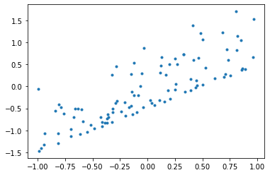
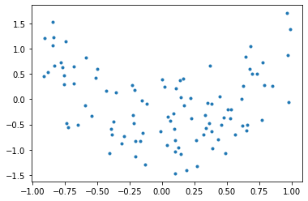

Introduction to polynomial regression
=====================================

Let’s start my first importing the pypce library and any third party
libraries we might need like numpy or matplotlib.

Setup the problem
-----------------

.. code:: ipython3

    import tesuract
    import numpy as np
    import matplotlib.pyplot as mpl

Now, let’s generate some two-dimensional multivariate data to show how
pypce works!

.. code:: ipython3

    rn = np.random.RandomState(123)
    X = 2*rn.rand(100,2)-1
    y = X[:,0] + .5*(3*X[:,1]**2-1) 
    print(X.shape,y.shape)

.. parsed-literal::

    (100, 2) (100,)

This generate a data matrix :math:`X` of size (nsamples,dim) and labeled
data :math:`y` of shape (nsamples,). We can plot the univariate data
using matplotlib.

.. code:: ipython3

    mpl.plot(X[:,0],y,'.')

.. parsed-literal::

    [<matplotlib.lines.Line2D at 0x1687a1510>]

.. code:: ipython3

    mpl.plot(X[:,1],y,'.')

.. parsed-literal::

    [<matplotlib.lines.Line2D at 0x1688d2c90>]

Note that the :math:`x_1` dependence on :math:`y` is more linear,
whereas the :math:`x_2` dependence is quadratic, which is done by
construction. Let’s keep this in mind so that we can make sure the
polynomial fit we obtain reflects this relation.

Fit a polynomial
----------------

Now let’s fit the polynomial. To do this we need to initialize the PCE
regression class. To do this, we need to define the order of the
polynomial we want to fit and the fit algorithm. These two common
parameters are referred to as hyper-parameters. We can optimize over
them later using the grid search methods in sklearn. For now, let us
choose a second order polynomial and a least squares fit algorithm.

.. code:: ipython3

    pce = tesuract.PCEReg(order=2,fit_type='linear')

Initialization is fast since no computation or basis construction has
been done. It is when we fit the polynomial that the basis construction
takes place. So let’s fit the polynomial!

.. code:: ipython3

    pce.fit(X,y)

.. parsed-literal::

    PCEReg(coef=array([ 4.28125939e-17,  1.00000000e+00, -6.66133815e-16,  0.00000000e+00,
            3.33066907e-16,  1.00000000e+00]))

This returns the object back and displays the coefficient vector. For
all intents and purposes, a user does not need to know what the
coefficients are, but for purposes of this tutorial, let us take a look
so that we can verify that the fit is correct.

.. code:: ipython3

    print("c=\n",pce.coef)
    print("multi-index:\n",pce.mindex)

.. parsed-literal::

    c=
     [ 4.28125939e-17  1.00000000e+00 -6.66133815e-16  0.00000000e+00
      3.33066907e-16  1.00000000e+00]
    multi-index:
     [[0 0]
     [1 0]
     [0 1]
     [2 0]
     [1 1]
     [0 2]]

Notice that coefficient array contains all zeros (essentially) except
for the second and last entries. This is actually by design! We defined
the function :math:`y` to be a simple sum of the first order Legendre
polynomial in :math:`x_1` and the second order Legendre polynomial in
:math:`x_2`. And if we look at the multi-index array, which represents
the components of each basis function, the second and last row
correspond to these exact polynomial terms. To be explicit, the
multi-index row :math:`[p,q]` represents the basis corresponding to the
product of the :math:`p^{th}` order polynomial in :math:`x_1` and the
:math:`q^{th}` order polynomial in :math:`x_2`.

Two final points before we move on. The linear fit algorithm worked
perfectly well since our data was not corrupted by noise. When noise
becomes a problem, or we expect outliers, it is probably better to use
the LassoCV or ElasticNetCV algorithms. The good news is that we have
wrappers that allow the user to perform a simple hyper-parameter search
to figure out the best fit. To show that a fit with regression would not
work well for this case, look at the following.

.. code:: ipython3

    pce_lasso = tesuract.PCEReg(order=2,fit_type='LassoCV')
    pce_lasso.fit(X,y)

.. parsed-literal::

    PCEReg(coef=array([-4.23429475e-04,  1.00037195e+00,  2.12998050e-04, -3.61174005e-04,
           -5.52452618e-04,  9.99757827e-01]),
           fit_params={'alphas': array([1.00000000e-12, 3.83118685e-12, 1.46779927e-11, 5.62341325e-11,
           2.15443469e-10, 8.25404185e-10, 3.16227766e-09, 1.21152766e-08,
           4.64158883e-08, 1.77827941e-07, 6.81292069e-07, 2.61015722e-06,
           1.00000000e-05, 3.83118685e-05, 1.46779927e-04, 5.62341325e-04,
           2.15443469e-03, 8.25404185e-03, 3.16227766e-02, 1.21152766e-01,
           4.64158883e-01, 1.77827941e+00, 6.81292069e+00, 2.61015722e+01,
           1.00000000e+02]),
                       'max_iter': 2500, 'tol': 0.01},
           fit_type='LassoCV')

The coefficient array in this case is over regularized but it’s not bad.
This is because the LassoCV is allowed to find the best regularization
parameter, which in this case it :math:`0`.

Feature importance
------------------

Let’s us now see how we can show the feature importances. For
polynomials, we use the total order Sobol sensitivity indices. This is
essentially a weighted average of the polynomial coefficients. This is
one of the nice properties of using orthogonal polynomials.

.. code:: ipython3

    pce.feature_importances_

.. parsed-literal::

    array([0.625, 0.375])

Sobol sensitivity indices essentially give us a metric for how much of
the total variance is explained by each individual variance. So what
this says is that :math:`x_1` is more importance to the variability of
the output. This doesn’t mean that :math:`x_2` doesn’t matter. Note the
syntax is similar to the random forest feature importance syntax in
sklearn.

Prediction
----------

Once the coefficient array is determined, typically by the fit function
or (less commonly) by pre-defining the coefficient array in the
constructor, we can make predictions. This is quite simple by using the
``predict`` class method.

.. code:: ipython3

    ypred = pce.predict(X)
    print('MSE: {0:2E}, \nMPE: {1:3E}'.format(np.mean((ypred-y)**2), np.mean(100*(ypred-y)**2/y**2)))

.. parsed-literal::

    MSE: 3.587487E-31, 
    MPE: 1.069409E-26

We can see this in another way by plotting the prediction vs the truth.
Ideally, the graph should align perfectly with a y=x line plot.

.. code:: ipython3

    mpl.plot(y,y,'k',alpha=1,ms=2)
    mpl.plot(y,ypred,'o')

.. parsed-literal::

    [<matplotlib.lines.Line2D at 0x16a995190>]

.. image:: test_nb_files/test_nb_24_1.png

Scale error
~~~~~~~~~~~

We mentioned before that :math:`X` must be scaled to be over [-1,1]
since the polynomials are defined on that range. Let’s see what happens
when we feed a polynomial outside that range.

.. code:: ipython3

    pce.fit(2*X,y)

::

    ---------------------------------------------------------------------------

    AssertionError                            Traceback (most recent call last)

    <ipython-input-14-d32815d055ad> in <module>
    ----> 1 pce.fit(2*X,y)
    

    ~/.pyenv/versions/3.7.6/lib/python3.7/site-packages/tesuract/pce.py in fit(self, X, y)
        881                 self.coef = None # set to none and fit again
        882 
    --> 883         self._compile(X) # build multindex and construct basis
        884         Xhat,y = check_X_y(self.Xhat,y)
        885             # assert len(self.coef) == self.multiindex.shape[0],"length of coefficient vector is not the same shape as the multindex!"

    ~/.pyenv/versions/3.7.6/lib/python3.7/site-packages/tesuract/pce.py in _compile(self, X)
        815         super().compile(dim=self._dim) # use parent compile to produce the multiindex
        816         self._M = self.multiindex
    --> 817         self.Xhat = self.fit_transform(X)
        818         return self
        819     def _quad_fit(self,X,y):

    ~/.pyenv/versions/3.7.6/lib/python3.7/site-packages/tesuract/pce.py in fit_transform(self, X)
        388         # only works for [-1,1] for far
        389         # compute multindex
    --> 390         assert np.amin(X) >= -1 and np.amax(X) <= 1, "range for X must be between -1 and 1 for now. scale inputs accordingly. "
        391         X = np.atleast_2d(X)
        392         if self.mindex is None:

    AssertionError: range for X must be between -1 and 1 for now. scale inputs accordingly. 

Note that we will NOT get an error if X is defined on :math:`[0,1]`.

.. code:: ipython3

    pce.fit(.5*(X+1),y)

In this case, the fit will not be what one expects since we expect the
input to be on [-1,1]. So be careful!!

Different fit algorithms
------------------------

Now let’s look at the accuracy of different fit algorithms. In this
example, we will train and test on the same set, but in a formal
setting, you should not do that (we will explore this in later
tutorials).

The different fit algorithms from sklearn are LassoCV, ElasticNetCV,
OmpCV, and linear least squares. We will fit a polynomial for each one
of these algorithms with and without noise to see how accurate they are.

.. code:: ipython3

    algs = ['linear', 'LassoCV', 'ElasticNetCV']
    for alg in algs:
        pce = pypce.PCEReg(order=2,fit_type=alg)
        pce.fit(X,y)
        ypred = pce.predict(X)
        print("Error using {0}: {1:.3E}".format(alg,np.sum((ypred-y)**2)))

They are all pretty good, but linear least squares gives the best fit.
Now, let’s try the same with noise! First, let us create an output
corrupted by simple additive white noise

.. code:: ipython3

    y_w_noise = y.copy() + .1*rn.randn(len(y))

.. code:: ipython3

    algs = ['linear', 'LassoCV', 'ElasticNetCV']
    for alg in algs:
        pce = pypce.PCEReg(order=2,fit_type=alg)
        pce.fit(X,y_w_noise)
        ypred = pce.predict(X)
        print("Error using {0}: {1:.3E}".format(alg,np.sum((ypred-y)**2)))

This time, LassoCV or ElasticNetCV give the best solution!
